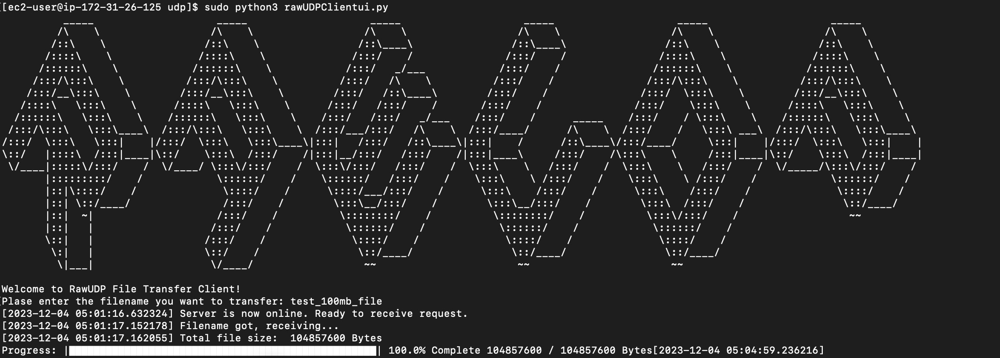
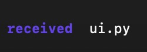

# Final Project RawUDP

This project consists of two main Python scripts: ```rawUDPClient.py``` and ```rawUDPServer.py```. These scripts implement a file transfer protocol over raw UDP sockets.

## Overview

### rawUDPClient.py

This script is the client-side application. The client starts by sending a READY message to the server. Once the server is online, the client sends the filename of the requested file. The server responds with the file size, and then the file transfer begins. The client saves the received file with the specified save name.

The client also includes a user interface that provides a progress bar to show the progress of the file download. 

### rawUDPServer.py

This script is the server-side application. It listens for incoming connections from clients. When a client sends a READY message, the server acknowledges it and waits for the filename. Once the filename is received, the server sends the file size and then starts the file transfer.

### packetParser.py

This class is for parsing the UDP packet.

### ui.py

Components of UI.

## Running the Scripts

First, follow the guide to create and set up two EC2 instances.
https://docs.google.com/document/d/1jCFw30jXA4XcEYFkmzaVIFxcJRLH7NWspTgE60xwG_I/edit

(In the 'Testing your application and Simulating packet loss' part. )

Second, use SCP to transfer packetParser.py, rawUDPClient.py to the server instance, and transfer packetParser.py, rawUDPServer.py, ui.py to the client instance. Then transfer the file to be sent in the 'sent' directory. This directory should be in same level as those scripts.

Third, on both instances change the MTU to 65535:
```
sudo ip link set dev enX0 mtu 65535
```

Finally, run the server and then run the client

To run these scripts, you need Python 3 installed on your machine. You can run the scripts using the following commands:

```python
sudo python3 rawUDPServer.py
sudo python3 rawUDPClient.py
```

Please ensure that the server script is running before starting the client script.



After that you will see the file in 'received/'.



By using md5 you could see the two files are same.
```
md5sum <FILE>
```

## Lesson Learned

From this project we acquire lots of knowledgement of UDP. We learned how to implement transferring files via UDP, including how to build IP and UDP header, how to use checksum, how to handle timeout, etc. Besides, we learned how to work as a team to solve many struggling issues. 

## Future Improvement

Now the server could only work for transferring one file when starting up. In future we will try to make it running forever.

Due to limited time the IP addresses and port numbers are written by hardcode. In future we will try to implement user input.

## Reference 
https://github.com/houluy/UDP

Logo of UI: https://patorjk.com/software/taag/#p=display&f=Alpha&t=RAWUDP

